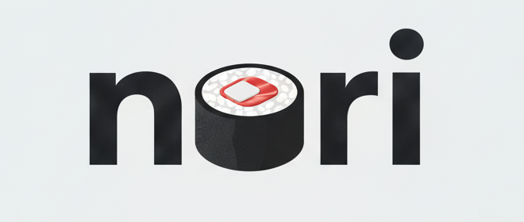

# nori



> Wrap your tools with elegance

**nori** is a deterministic, cross-platform package manager that wraps your development tools in a simple, consistent interface—just like nori (seaweed) wraps sushi to make it easier to handle.

> **Note**: Currently, nori supports **Neovim** only. More packages will be added to the registry soon.

## Installation

### Building from Source

**Prerequisites:**
- Go 1.25.3 or later

**Build steps:**

```bash
# Clone the repository
git clone https://github.com/chirag-bruno/nori.git
cd nori

# Build the binary
go build -o nori ./cmd/nori

# (Optional) Install to a directory in your PATH
# For example, on macOS/Linux:
sudo mv nori /usr/local/bin/

# Or on macOS with Homebrew prefix:
mv nori /opt/homebrew/bin/
```

### Initial Setup

After installing nori, you need to initialize it to add the shims directory to your PATH:

```bash
# Initialize nori (adds ~/.nori/shims to PATH)
nori init

# Reload your shell configuration
source ~/.zshrc  # for zsh
# or
source ~/.bashrc # for bash
```

This will:
- Create the `~/.nori` directory structure
- Add `~/.nori/shims` to your PATH in your shell profile
- Set up the environment for managing packages

### Quick Start

```bash
# Update the registry to get the latest package information
nori update

# Search for packages
nori search neovim

# Get information about a package
nori info neovim

# Install a package
nori install neovim@0.9.5

# Set a version as active
nori use neovim@0.9.5

# List installed packages
nori list
```

## Philosophy

### The Problem

Existing package managers have grown complex:

- **Homebrew** is powerful but massive, with intricate internals that are hard to understand
- **asdf** requires package authors to write bash scripts, creating maintenance burden
- Most tools lack **determinism**—the same install can produce different results
- **Cross-platform support** is often an afterthought

### The Solution

nori wraps packages with:

- **Simplicity**: No scripts from publishers. Ever. Just declarative YAML manifests.
- **Determinism**: Fixed directory layout, mandatory checksums, reproducible installs.
- **Cross-platform**: Built-in support for Linux, macOS, and Windows from day one.
- **Single source of truth**: Public registry with per-package YAML manifests.
- **Stable PATH**: One shim directory added to PATH once—no constant manipulation.

## How It Works

nori wraps your tools in a clean abstraction layer:

```
┌─────────────────────────────────────┐
│         Your Tools (node, python)   │
│  ┌───────────────────────────────┐  │
│  │   nori shims (the wrapper)    │  │
│  └───────────────────────────────┘  │
│         nori (the manager)          │
└─────────────────────────────────────┘
```

Just as nori wraps food to make it easier to handle, nori wraps your packages so you can manage them with elegance and consistency.

## Design Principles

1. **No scripts from publishers**: Publishers only declare what exists, not how to install it
2. **Single source of truth**: One registry, one manifest per package
3. **Deterministic installs**: Same inputs always produce same outputs
4. **Cross-platform by default**: Platform selection is automatic, not manual
5. **Stable PATH**: One shim directory, added once, never changed

## Comparison

| Feature | nori | Homebrew | asdf |
|---------|------|----------|------|
| Simplicity | ✅ Declarative YAML | ❌ Complex internals | ⚠️ Bash scripts required |
| Determinism | ✅ Fixed layout + checksums | ⚠️ Varies | ⚠️ Plugin-dependent |
| Cross-platform | ✅ Built-in | ⚠️ macOS-first | ✅ Via plugins |
| Package author burden | ✅ YAML only | ❌ Formula complexity | ❌ Bash scripting |
| PATH management | ✅ Single shim dir | ⚠️ Multiple locations | ⚠️ Per-tool manipulation |

---

**nori** — because your tools deserve to be wrapped with elegance.
